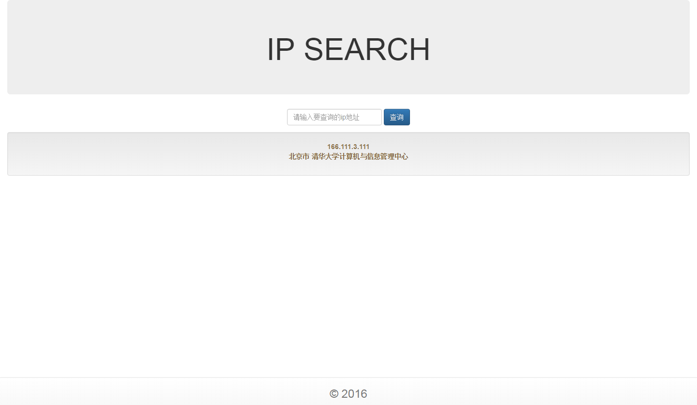

# 练习题

## IP Search

## MD5 Decrypt

> [0-9]{8}

## Library
1. 管理员登录后维护图书信息
2. 用户登录后查询图书信息
3. 用户登录可以借阅图书*（管理员操作）*
4. 用户登录可以归还图书*（管理员操作）*
5. 管理员登录后查询图书借阅情况
6. 用户登录后查询自己的借阅记录

附加要求：
1. 表单验证
2. 日期控件
2. 页面样式