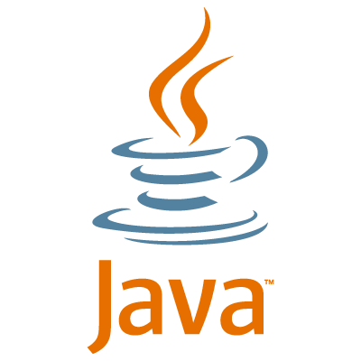

# Java SE

> 教学要求

1. 初步理解面向对象的程序设计

> 课外参考

1. [Java SE API](http://docs.oracle.com/javase/7/docs/api/)
2. [Java编程思想(第4版)](http://www.amazon.cn/Java%E7%BC%96%E7%A8%8B%E6%80%9D%E6%83%B3-%E5%9F%83%E5%8F%B2%E5%B0%94/dp/B0011F7WU4/ref=sr_1_1?ie=UTF8&qid=1449502095&sr=8-1&keywords=java)
3. [Effective Java中文版(第2版)](http://www.amazon.cn/Sun-%E5%85%AC%E5%8F%B8%E6%A0%B8%E5%BF%83%E6%8A%80%E6%9C%AF%E4%B8%9B%E4%B9%A6-Effective-Java%E4%B8%AD%E6%96%87%E7%89%88-Joshua-Bloch/dp/B001PTGR52/ref=sr_1_1?ie=UTF8&qid=1451488145&sr=8-1&keywords=effective+java)

> Outline

1. [引言](intro.md)
2. [语言基础](basic.md)
3. [面向对象](oop.md)
4. [集合](collection.md)
5. [泛型](generics.md)
6. [异常](exception.md)
7. [IO](io.md)
8. 附：[练习题](exercise.md)

> 补充内容

    1. 内部类
    2. 注释类型
    3. 序列化
    4. 反射
    5. 多线程