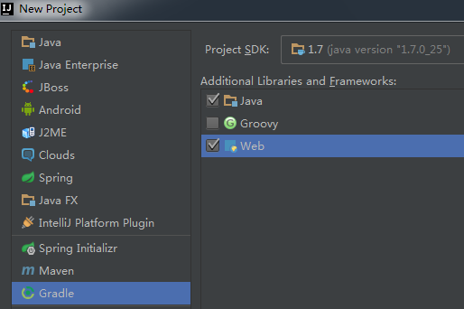

# IDEA


1. unzip IDEA.zip to your-idea-install-folder

2. 修改 IDEA 配置文件 your-idea-install-folder/bin/idea.properties

  ```
  idea.config.path=your-idea-properties-folder/config
  idea.system.path=your-idea-properties-folder/system
  idea.plugins.path=${idea.config.path}/plugins
  idea.log.path=${idea.system.path}/log
  ```

3. 修改两处配置

  ```
  File - Settings - Keymap
  Main menu - Code - Completion - Basci
  Add Keyboard Shortcut: Alt+斜杠

  File - Settings - Editor - Code Completion
  Case sensitive completion: None
  ```
  
4. IDEA key map reference
  
    [http://thu.github.io/IDEA/](http://thu.github.io/IDEA/)
    
5. 创建基于 Gradle 构建的 Java Web 项目

  - 安装 gradle
    - 参见 [Gradle 的安装](gradle.md)
  - 创建项目

    ```
    IDEA > File > New > Project... 
    
    左侧 选择 Gradle 
    右侧勾选 Java 和 Web
    单击 Next
    参见图一
    
    填写 GroupId 和 ArtifactId
    单击 Next
    
    勾选 Create directories for empty content roots automatically
    选择 Use local gradle distribution
    指定 Gradle home
    单击 Next
    参见图二
    
    确认 Project name 和 Project location
    单击 Finish
    ```
    
    图一
    
    
    
    图二
    
    
    
    
    
